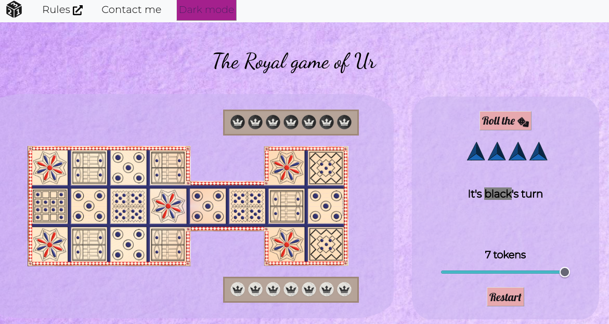

# GAME OF UR BOARDGAME

------

Boardgame protoype written in React. Feel free to fork it.

[Available at this site](https://affectionate-agnesi-fd487f.netlify.app/).

## Table of contents

- [Overview](#overview)
  - [Features](#features)
  - [Instructions of the game](#instructions-of-the-game)
- [Implementation](#implementation)
  - [Prerequisites](#prerequisites)
  - [Building instructions](#building-instructions)
  - [Built with](#built-with)
- [Contact me](#contact-me)

## Overview



### Features

- Play against a human
- Change the number of tokens.
- Responsive design.
- Switching between light and dark mode.

### Instructions of the game

[Instruction page at mastersofgames.com](https://www.mastersofgames.com/rules/royal-ur-rules.htm)

## Implementation

### Prerequisites

- Node.js
- npm

### Building instructions

```bash
# Clone the repository
$ git clone https://github.com/Edax97/ur-game.git

# Move into the repository
$ cd ur-game

# Install dependencies
$ npm install

# Start the development server
$ npm start
```

### Built with

- React.js library
- CSS custom properties
- Sass extension styling
- Bootstrap for React

## Contact me

[My Linkedin page](https://www.linkedin.com/in/edwin-edmar-campos-alarcon/)
